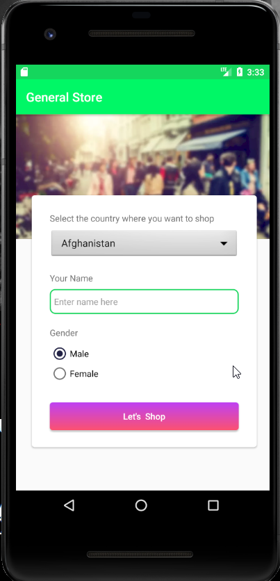
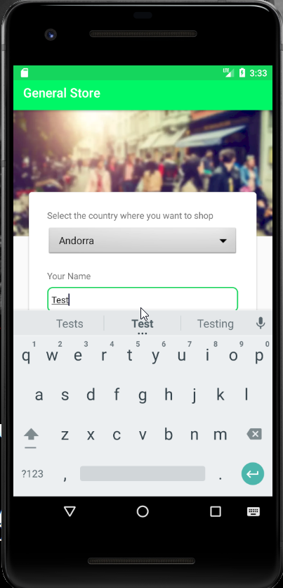
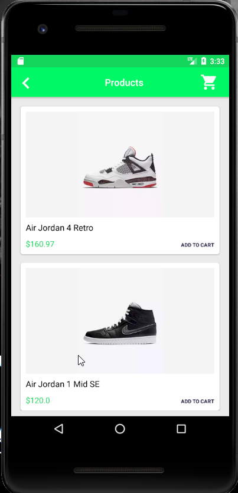
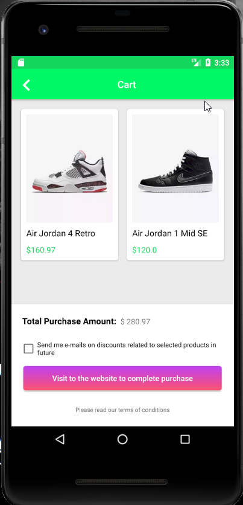
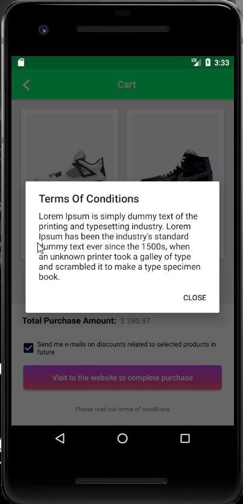

# Framework design created for automating general store mobile demo app using Appium 

1.    2.  

3.   4. 

 
5.   6. 

7. 

***Used tools: for automating general store mobile demo app***

- Framework  used : ***APPIUM, TestNG***
- Design pattern used : ***Page Object Model***
- Automation server used:***Jenkins***
- Version control used : ***Git***	
- Reporting library used: Extent Report

 

***Operation automated on mobile app*** 
- Selecting multiple  elements from the page.
- Scrolling dropdown till value expected visible
- Select or Touch specified Element from dropdown 
- Selecting radio box button.
- Entering values under edittext field.
- Entering values under edittext field.
- Selecting multiple  elements from the page.
- Hiding opened mobile keyboard.

- ***Demo application can be found under directory*** :\src\test\java\res\ApiDemos-debug.apk

- ***Maintained properties file having ipAddress,Port number ,browser,AndroidDeviceName under directory*** : src\test\java\res\prop.properties

***Some used Git commands are:***

- git config
- git init
- git clone
- git add
- git commit 
 - git status
- git branch
- git checkout
- git merge
- git push
- git pull
- git stash

